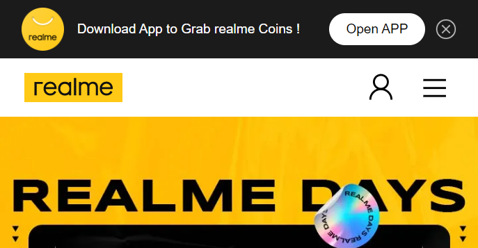
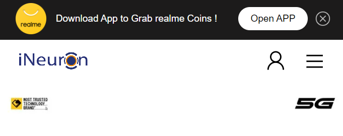

Problem 11.

Webiste Name: [realme](https://www.realme.com/in/)

### Topics

       querySelector,style,background-image

### Sample Image

### Tasks

    change the realme logo to ineuron logo

### Output

JavaSript code:

        const rakshith = document.querySelector(".icon-logo");
    	rakshith.style.backgroundImage = "url('https://ineuron.ai/images/ineuron-logo.png')";

