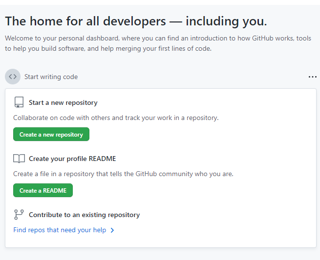

Problem 12.

Webiste Name: [Github](https://github.com/)

### Topics

       querySelector,style,background-Color

### Sample Image

### Tasks

     change the background colour of the button to blue.

### Output

JavaSript code:

        document.querySelectorAll('.btn-primary')[1].style.backgroundColor = "blue";

