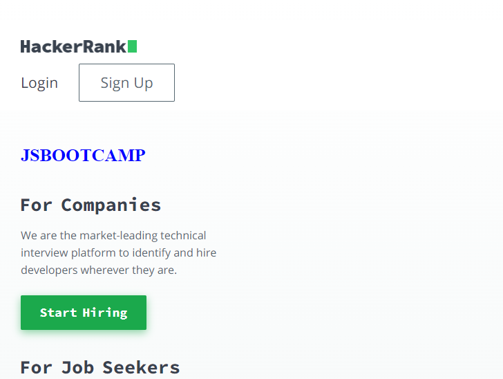

Problem 13.

Webiste Name: [Hackerrank](https://www.hackerrank.com/)

### Topics

       querySelector,innerHtml

### Sample Image

### Tasks

Target the top description and change “Matching developers with great companies” to ‘JSBOOTCAMP“.

### Output:

JavaSript code:

Type-1:

       document.querySelector(".site").getElementsByTagName("h1")[0].innerText = "JSBOOTCAMP";

Type-2:

    const text = "JSBOOTCAMP"
    	const rakshith = document.querySelector(".site").getElementsByTagName("h1")[0];
    	rakshith.innerText = text;
    	rakshith.style.fontWeight = "700";
    	rakshith.style.color ="blue";

