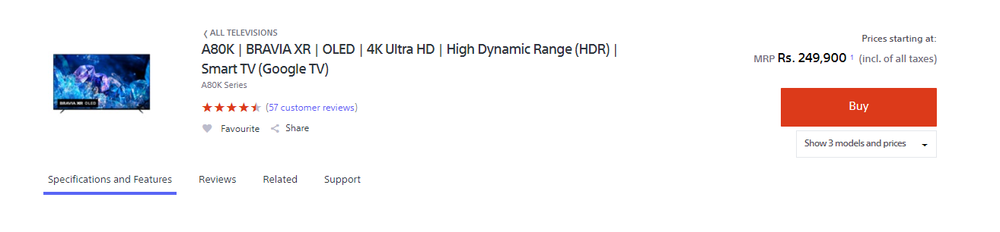
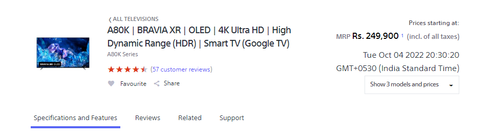

Problem 17.

Webiste Name: [Sony](https://www.sony.co.in/)

### Topics

    querySelector,innerHTMl

### Sample Image

### Tasks

     change the button text To current Date.

### Output:

JavaSript code:

    var date = new Date();
    document.querySelector(".btn-container").innerHTML = date;

