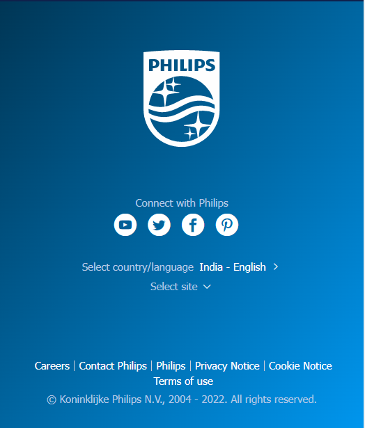
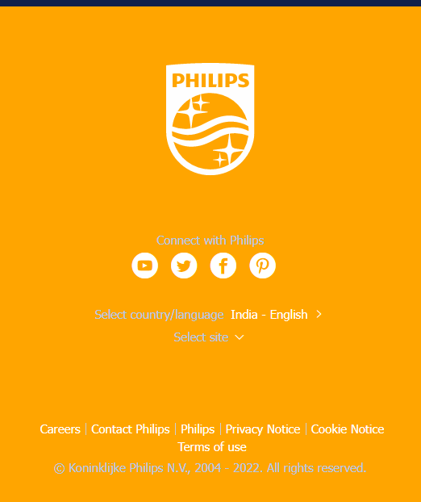

Problem 18.

Webiste Name: [Philips](https://www.philips.co.in/)

### Topics

     querySelector,style,backgroundcolor

### Sample Image

### Tasks

    change the background colour blue to orange

### Output:

JavaSript code:

       const rakshith = document.querySelector(".p-f03-footer-container");
    	rakshith.style.background = "orange";

