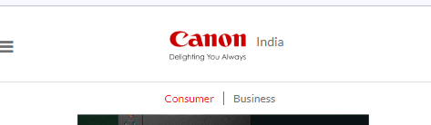
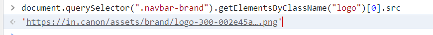

Problem 19.

Webiste Name: [Canon](https://in.canon/)

### Topics

          querySelector,src

### Sample Image

### Tasks

    extract the canon logo

### Output:

JavaSript code:

       document.querySelector(".navbar-brand").getElementsByClassName("logo")[0].src

