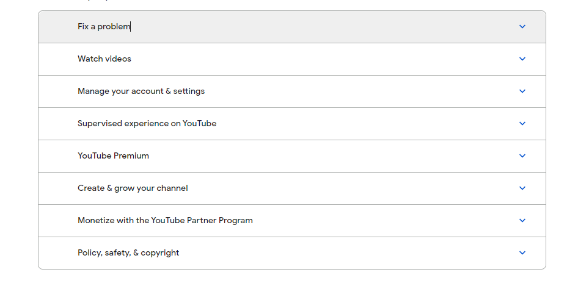
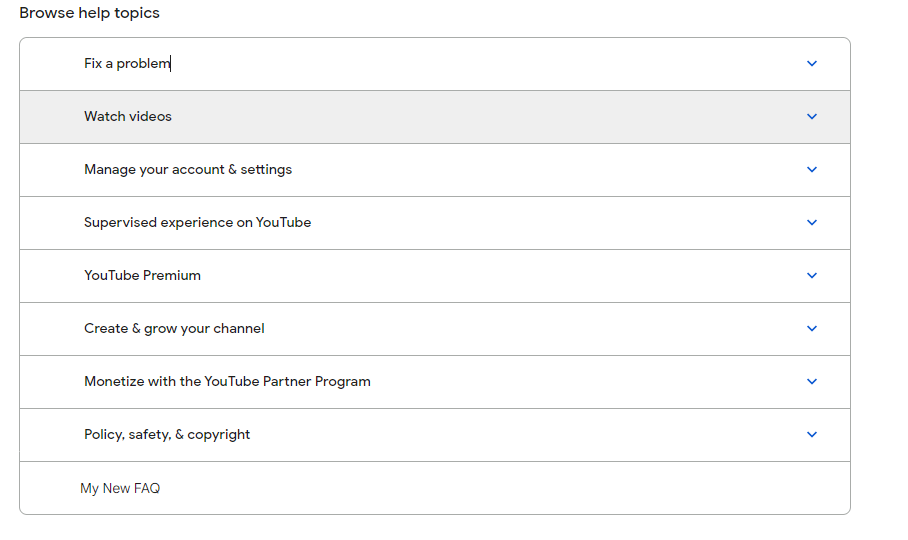

3. Webiste Name: [Youtube Support](https://support.google.com/youtube/)

### Topics

    - Get Element By Id, Create Element, Create Text Node, Append Child

### Sample Image

### Tasks

     Add another FAQ 'My New FAQ' to the list

### Output:

JavaSript code:

       const section = document.createElement("section");
    	section.innerHTML = "My New FAQ";
    	document.querySelector(".article").append(section);
    	section.style.borderTop = "1px solid #a9acaa";
    	section.style.paddingLeft = "60px";

