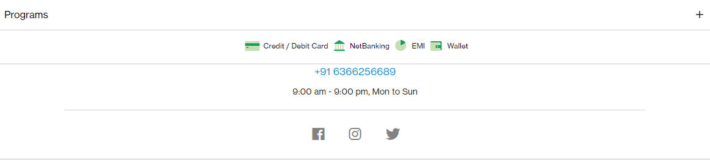

# Problem 4.

Webiste Name: [OnePlus](https://www.oneplus.in/support)

### Topics

     Query Selector, InnerText

### Tasks

Change the contact number

### Output:

JavaSript code:

        document.querySelector(".one-tel-number").innerText = "+91 6366256689";

