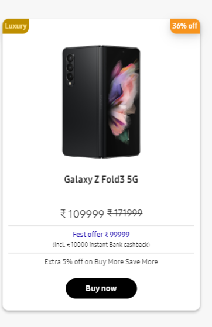

# Problem 5.

Webiste Name: [Samsung](https://www.samsung.com/in/offer/online/samsung-fest/)

### Topics

       getElementById, createElement, InnerText, append, setAttribute

### Tasks

     Target the main div of card and change the Button text to Check out

### Output:

JavaSript code:

        document.getElementById("gly-z"),document.getElementsByClassName("bnbtn")[0].innerText = "Check out";

