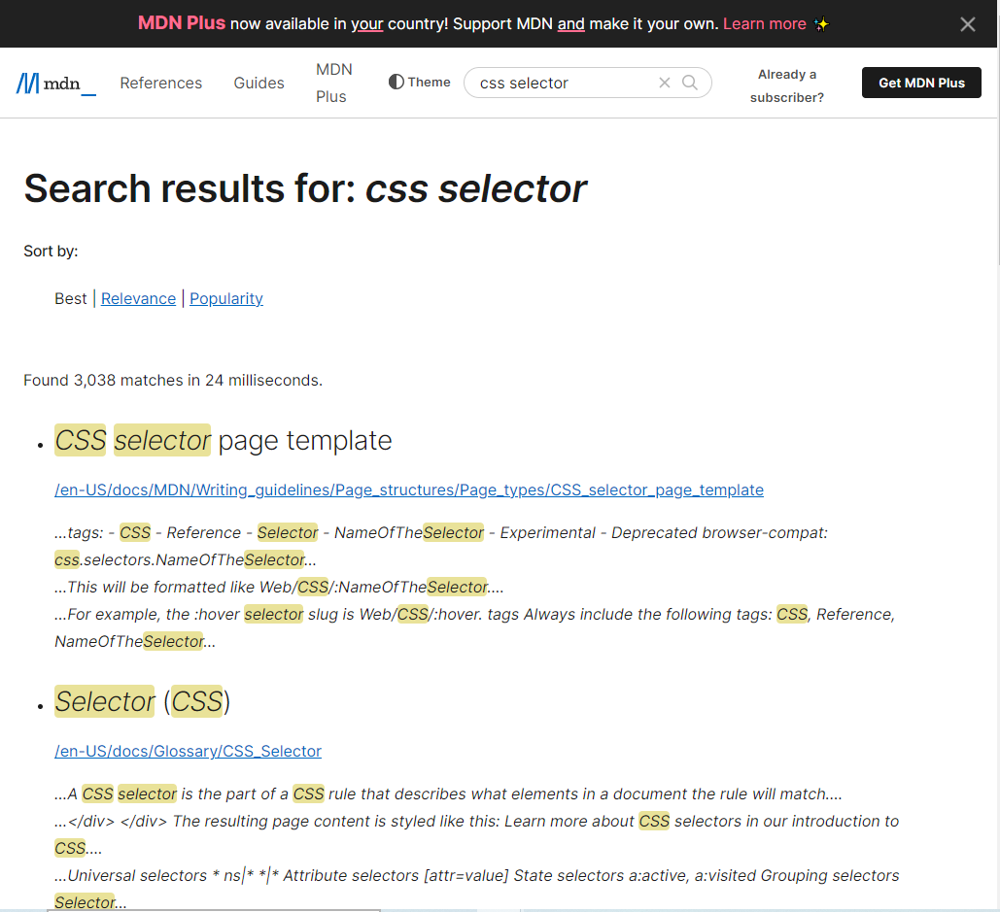

# Problem 7.

Webiste Name: [MDN Web Docs](https://developer.mozilla.org/en-US/)

### Tasks

     To Search a topic in the MDN Search bar.
     First add a text to search in the search bar and then hit the submit search button to search the docs using DOM

     ### Output:

JavaSript code:

        document.querySelector(".searchinput___19uW0");

        document.querySelector(".searchinput**_19uW0").addEventListener("mouseover",function(){
        document.querySelector(".searchinput_**19uW0").style.backgroundColor= "red";
        });
        document.querySelector(".searchinput**_19uW0").addEventListener("mouseout", function() {
        document.querySelector(".searchinput_**19uW0").style.backgroundColor= "initial";
        });

